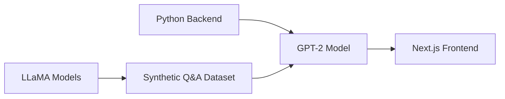

# 👋 Hello, I'm Lucien Laumont

<div align="center">


</div>

---

I'm a **Data Science & AI Engineer** with a strong foundation from ESIEE Paris (Class of 2024–2025). Driven by curiosity and a love for innovation, I thrive on solving complex problems using data-driven approaches and machine learning techniques.

```python
class LucienLaumont:
    def __init__(self):
        self.name = "Lucien Laumont"
        self.role = "Data Science & AI Engineer"
        self.location = "Paris, France"
        self.education = "ESIEE Paris - Master's in Data Science & AI"
        self.passion = ["Machine Learning", "AI Innovation", "Problem Solving"]
        
    def get_skills(self):
        return {
            "languages": ["Python", "R", "SQL", "C"],
            "frameworks": ["Next.js", "TensorFlow", "Scikit-learn"],
            "databases": ["PostgreSQL", "Vector DBs - Pinecone"],
            "ai_tools": ["Mistral AI", "Hugging Face", "LLaMA"],
            "deployment": ["Render", "Docker", "Cloud Platforms"]
        }
```

---

## 🎓 Education

<table>
<tr>
<td>

**🏫 ESIEE Paris**  
📚 Master's in Data Science & AI  
📅 Class of 2024–2025

</td>
<td width="200">


</td>
</tr>
</table>

---

## 💼 Professional Experience

### 🚀 Data Science & AI Intern
**📍 Vancouver, Canada** | **⏱️ 6 months**

<details>
<summary><strong>🛠️ Full-stack Development</strong></summary>


- Backend services in **Python**
- Frontend interfaces with **Next.js**

</details>

<details>
<summary><strong>🗄️ Database & Deployment</strong></summary>


- Designed schemas and managed data in **PostgreSQL**
- Deployed and monitored the entire system on **Render**

</details>

<details>
<summary><strong>🤖 Advanced AI Integration</strong></summary>


- Leveraged **Mistral AI's** cutting-edge models—**Embedding**, **OCR**, and **Mistral Large**
- Built a scalable **R.A.G.** (Retrieval-Augmented Generation) pipeline for real-time document querying

</details>

<details>
<summary><strong>📄 Document Processing & Performance</strong></summary>


- Engineered **regex-based chunking algorithms** for optimal document segmentation
- Optimized chunk size and indexing for minimal latency and maximum retrieval accuracy

</details>

---

## 🎓 Academic Projects

### 🏆 Road Accident Severity Prediction Competition
[](https://github.com/LucienLaumont/E4_KaggleCompetition)

<table>
<tr>
<td width="70%">

**🎯 Event:** ESIEE Paris Data Science & AI E4 ML Challenge  
**👥 Participants:** ~60 competitors  
**🎯 Objective:** Highest AUC for road accident severity prediction  
**📊 Dataset:** 40+ variables (road type, weather conditions, etc.)  
**⏰ Duration:** 2-month competition

</td>
<td width="30%" align="center">

  


</td>
</tr>
</table>

---

### 👨‍🍳 Cooking Assistant Chatbot
[](https://github.com/LucienLaumont/GPT-LifeAssistant-ESIEE)

<div align="center">


</div>

**🎯 Objective:** Fine-tune a **GPT-2** model to serve as an interactive cooking assistant

#### 🛠️ Tech Stack


#### 📊 Data Pipeline
- Generated synthetic Q&A dataset using **open-source LLaMA models** on Hugging Face
- Curated and cleaned prompts for realistic cooking scenarios

---

<div align="center">

### 📫 Let's Connect!

[](https://linkedin.com/in/lucien-laumont)
[](mailto:laumontlucien@gmail.com)
[](https://github.com/LucienLaumont)

</div>

---

<div align="center">
<i>"Driven by curiosity, powered by data, inspired by innovation."</i>
</div>
